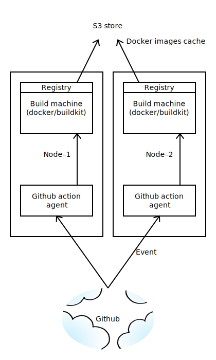

# github-actions-runner

Self-hosted runner fot github actions

Example to use .github/workflows/pr.yaml

__runs-on__ set to __self-hosted__

```yaml
jobs:
  build-image:
    runs-on: self-hosted
    steps:
      - name: Build
        run: make build
```

## Get help

```bash
make help
```

## Build and push

```bash
make build
make push
```

## Run runner localy

```bash
make build

export RUNNER_REPOSITORY_URL=https://github.com/sergelogvinov/github-actions-runner
export RUNNER_TOKEN=_TIKEN_
export DOCKER_HOST=tcp://host:port
make run
```

## Run runner on k8s

```bash
cat <<EOF > .helm/build-machine/values-dev.yaml

replicaCount: 2

docker:
  enabled: true

registry:
  enabled: true
EOF

cat <<EOF > .helm/github-actions/values-dev.yaml

replicaCount: 2
envs:
  DOCKER_BUILDKIT: "1"
  DOCKER_HOST: tcp://build-machine:2376
  RUNNER_REPOSITORY_URL: https://github.com/sergelogvinov/github-actions-runner
  RUNNER_TOKEN: _TOKEN_
EOF

make deploy

kubectl get pods -owide

build-machine-0                    2/2     Running   0          1h     10.37.0.1    node-1    <none>           <none>
build-machine-1                    2/2     Running   0          1h     10.42.0.1    node-2    <none>           <none>
github-actions-0                   1/1     Running   0          1h     10.37.0.3    node-1    <none>           <none>
github-actions-1                   1/1     Running   0          1h     10.42.0.3    node-2    <none>           <none>
```

Gighub-actions worker receive tasks from server.
Worker runs commands on docker host.
Docker host has docker-registry on localhost.
You can use __--cache-from__ to receive build cache from local registry.



## Pricing

* One worker requares - 4CPU-16Gb
* Average worker busy time per day - 9h (8h-5days + 1h-5days nightly tests)

| Instance type | Capacity | Workers count | Price month | Comment
|---|---|---|---|---|
| Bare-metal | 24CPU-128GB-1Tb(NVME)  | 6 | __100__ | monthly rent |
| Bare-metal | 12CPU-64GB-512Gb(NVME) x 2   | 6 | 65 * 2 = __130__ | monthly rent |
| VM         | 4CPU-16GB-160Gb(SSD)  | 6 | 19 * 6 = __114__ | monthly rent |
| VM                    | 4CPU-16GB-160Gb(SSD)  | 6 | 0.0312 * 6 * 9 * 20 = __33__ | hourly rent |
| GCP (n2d-standard-4)  | 4CPU-16GB        | 6 | 108 * 6 = __652__ | monthly rent |
| GCP (n2d-standard-4)  | 4CPU-16GB        | 6 | 0.184 * 6 * 9 * 20 = __198__ | hourly rent |
| GCP (n2d-standard-4) spot | 4CPU-16GB-64GB(SSD) | 6 | ??? * 6 * 9 * 20 + 12 = __93__ | hourly rent |
| Github hosted         | ? | 6 | 0.008 * 60 * 6 * 9 * 20 = __518__ | hourly rent |
